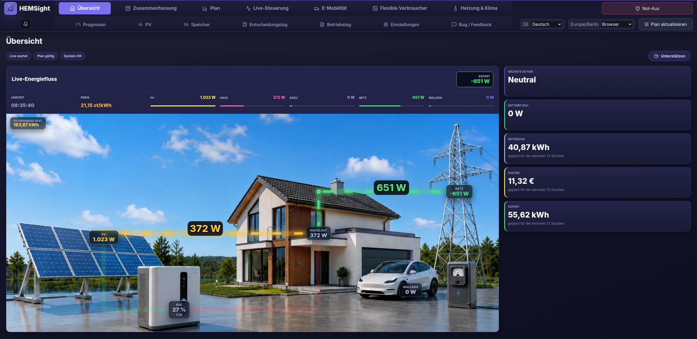
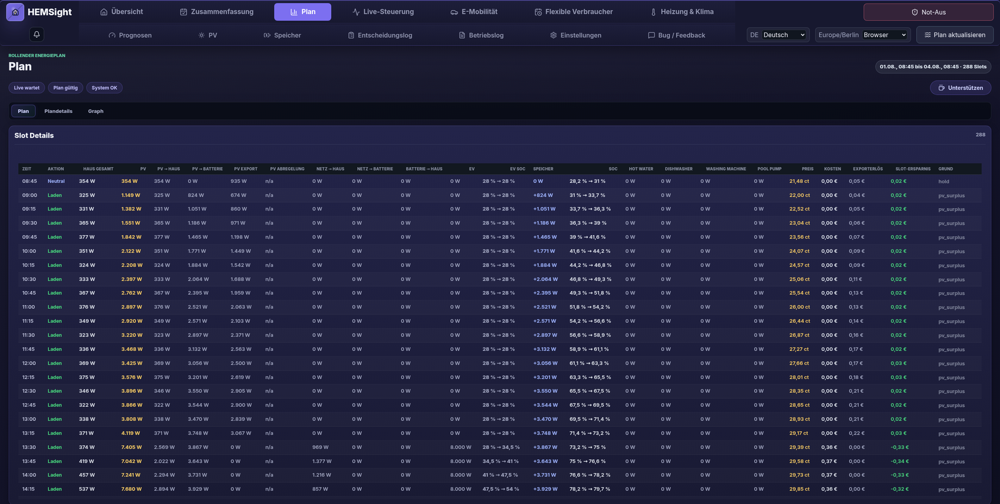

<h1 align="center">HEMSight</h1>

<p align="center">
  <strong>Home energy manager – plans your electricity and switches your devices</strong>
</p>

<p align="center">  <a href="LICENSE"></a> </p>

<p align="center"><strong><a href="https://hemsight.de">hemsight.de</a></strong> – all features at a glance and the full manual</p>

<p align="center"><a href="README.md">Deutsch</a> · English</p>

> **Early beta.** Testers wanted!

At three in the morning electricity is sometimes half the price it is at seven in the
evening. And when the sun really hits the roof, nobody is usually home to start the
washing machine.

That's what HEMSight is for. It works out when things are worth doing over the next few
days, and then switches your devices itself. Everything runs in your home, no cloud, no
subscription.

**If you like the project and want to support me:**

<a href="https://ko-fi.com/hemsight"></a> <a href="https://github.com/sponsors/Markus660"></a>

---

<p align="center">
  
</p>

## What HEMSight does for you

Your car no longer starts charging the moment the cable is plugged in. It waits for the
cheap hours and is still full in the morning.

Your solar surplus goes into hot water, the battery or the car instead of being sold to
the grid for a few cents.

The washing machine and the dishwasher start when the sun is out, or when electricity
costs next to nothing. You only load them.

The battery fills up before the expensive hours. If tomorrow morning brings sun anyway, it
stays empty.

Heating and air conditioning hold your temperature, but do the work when electricity is
cheap.

And if a switching decision ever looks odd to you, every one of them says why it happened.
Top right there's an emergency stop that halts everything at once.

<p align="center">
  
</p>

The plan is the heart of it: quarter-hour steps across the next two to three days with
everything that's meant to happen. It's recalculated continuously as weather, prices or
your consumption change.

## What you need

What you already have. Solar, a battery, a wallbox, a heat pump, a dynamic tariff –
HEMSight takes all of it, and none of it is required. Solar and a tariff alone are already
worth it.

Home Assistant isn't a must. If you have it, you save a lot of setup work, because your
devices are already there.

## Versions

### 0.0.8-beta

- The new plan solver was not included in the add-on or the Docker image at all; it is now, and plans get better and faster.
- Several situations produced no plan at all: a battery above its charge limit, a throttled primary battery, and a car alongside several batteries.
- The plan now says whether it really is the best one. When none is found, it says what is in conflict.
- The live page names, for each device individually, which precondition control is still missing.
- Dishwasher and pool pump run in the sun again, even while the car is plugged in.
- Texts that HEMSight passed through from the server unchanged now arrive in the language you selected.
- Plus around twenty further fixes across planning, batteries, charge planning and devices.

The full [changelog](hemsight/CHANGELOG.md) is in the add-on directory.

### 0.0.7-beta

- The plan now covers two days instead of three; the setting for it is gone.
- When the car charges in PV mode, it now gets the solar surplus before the home battery does.
- Large systems get a plan again: if the fine-grained run does not finish, HEMSight continues with a coarser one instead of giving up.
- Anker devices can be read directly on the local network, without an Anker account and without Home Assistant.
- Batteries that support it now charge from the grid steplessly instead of all or nothing.
- If a device points at a Home Assistant entity that does not exist, HEMSight says so and lets you fix it in the settings.
- Plus around thirty further fixes across planning, batteries, charge planning, hot water and setup.

The full [changelog](hemsight/CHANGELOG.md) is in the add-on directory.

### 0.0.6-beta

- Electricity prices can now come from any Home Assistant sensor, your own price lists can be imported as a CSV or JSON file, and Ostrom is connected with your own customer credentials.
- HEMSight now plans without a home battery too – a solar system with a wallbox, or with switchable loads only, gets a full plan.
- Two unequal batteries, or a battery with a raised lower limit, no longer make the plan impossible.
- A switchable load now really keeps to its configured daily runtime.
- Overview and minute optimisation now name each reason why HEMSight is not controlling yet, and lead to the setting that resolves it.
- The phase selection for EV charging now takes effect in the preview, the planned schedule and live control.
- Plus around forty further fixes across planning, flexible loads, setup and integrations.

The full [changelog](hemsight/CHANGELOG.md) is in the add-on directory.

### 0.0.5-beta

- Deleting a device now works both directly on its card and in the collapsible management list.
- PV yield behind a DC-coupled battery is now detected automatically and split correctly between generation and household consumption.
- The PV forecast no longer lags the sun by a quarter hour, and wind speed is now used in the correct unit.
- Battery direction, derived household load and daily totals are now shown reliably.
- Plus about a dozen further fixes across planning, setup and live control.

The full [changelog](hemsight/CHANGELOG.md) is in the add-on directory.

### 0.0.4-beta

- Flexible loads can be switched on and off directly on the operations page.
- Data problems – rejected credentials, a dead source, a missing sensor – now raise their own notification instead of getting lost in the log.
- The operations log shows every notice separately, translated and sorted by urgency.
- A rejected save in the setup assistant now names the reason and the field; a number field left empty is no longer stored as 0.
- Dishwashers and washing machines report "finished" again on long programmes, instead of "runtime exceeded".
- A single overwritten credential no longer throws a configured system back into setup.
- Plus around twenty further fixes across notifications, setup and data storage.

The full [changelog](hemsight/CHANGELOG.md) is in the add-on directory.

### 0.0.3-beta

- Grid import can be capped, and the plan respects the cap.
- New sensors are backfilled with the last 14 days from Home Assistant – the load forecast no longer starts from scratch.
- Batteries with separate charge and discharge inputs can now be controlled fully.
- The overview shows measured values for the current day instead of totals across the planning horizon.
- HEMSight keeps a record of what it predicted and when, making forecast accuracy verifiable.
- Hot water limits are enforced in the plan and in live control alike.
- Plus around fifty fixes across planning, battery control, integrations and setup.

The full [changelog](hemsight/CHANGELOG.md) is in the add-on directory.

### 0.0.2-beta

- Fronius Wattpilot is now available as a direct integration.
- Vehicles connected through Home Assistant can now also provide charging status, plug status and actual charging current, for example through TeslaMate MQTT sensors.
- Wallbox setpoint, actual current and maximum current are handled separately.
- A wallbox command is only considered confirmed after the device has reported it back.
- Solar-surplus charging for electric vehicles uses rising surplus directly and reacts correctly when other devices need power.
- The notification daily summary now covers the completed previous day.
- Planning with multiple batteries no longer stops when grid charging is disabled (`SolverConfig object has no field "grid_charge_enabled"`).
- Non-critical notifications are no longer sent for every single short-lived problem.

The full [changelog](hemsight/CHANGELOG.md) is in the add-on directory.

## Installation

Two ways, both pulling the same ready-made program from the GitHub container registry.

### In Home Assistant

1. Settings → Apps → Install app
2. Three-dot menu in the top right → Repositories
3. Add `https://github.com/Markus660/hemsight`
4. HEMSight shows up as a new card. Install, start, done.

It then lives inside your Home Assistant interface, behind your HA login. No extra port,
no second password.

### With Docker

```bash
bash -c "$(curl -fsSL https://raw.githubusercontent.com/Markus660/hemsight/main/install.sh)"
```

One command. It checks that Docker is ready, creates the `hemsight` directory, fetches the
Compose file, pulls the images and starts them. The finished address is printed at the end.
If the usual port is already taken it moves to the next free one and tells you.

If an installation is already there, the same command updates it – your `data/` is left
alone. So updating later means running it once more.

If you'd rather see what happens, do it by hand; the [script](install.sh) does nothing else:

```bash
mkdir hemsight && cd hemsight
curl -fsSLO https://raw.githubusercontent.com/Markus660/hemsight/main/compose.yaml
docker compose up -d
```

Then open `http://<your-address>:18081` in the browser. The setup assistant takes care of the
rest on first start, including your password.

On a Linux server, in an LXC container or in a VM it's exactly the same way. For EEBus
devices, add `docker compose --profile eebus up -d`.

Your settings end up in `data/` next to the `compose.yaml`, or under `/data` with the Home
Assistant app. That directory belongs in your backup.

To update, `docker compose pull && docker compose up -d` is enough – the Compose file picks
up the newest release on its own, there is no need to download it again.

If you'd rather stay on one release, or set the key that encrypts your credentials, put a
`.env` next to it; the template with all the explanations is [here](.env.example). It isn't
required. If a version number from an earlier install is still in there, you stay on it
until you change or remove that line.

## Testers wanted!

The manual, with everything that can be configured, is at **https://hemsight.de**.

Please send me any feedback straight from the app via the *Bug / Feedback* tab – whether
something works, and especially when it doesn't. It attaches a diagnostic report that
usually shows me the cause. If you never get that far, open an
[issue](https://github.com/Markus660/hemsight/issues/new/choose) here.
